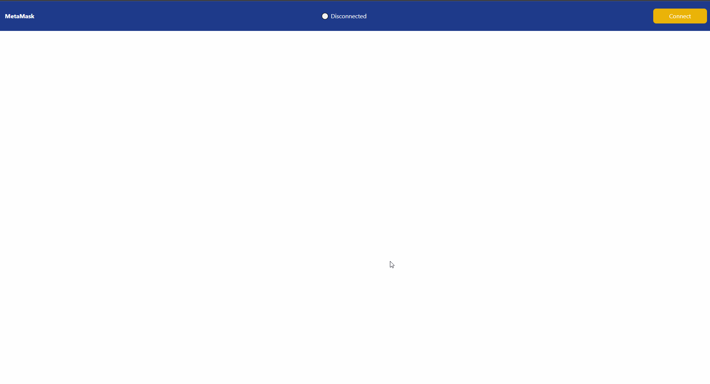
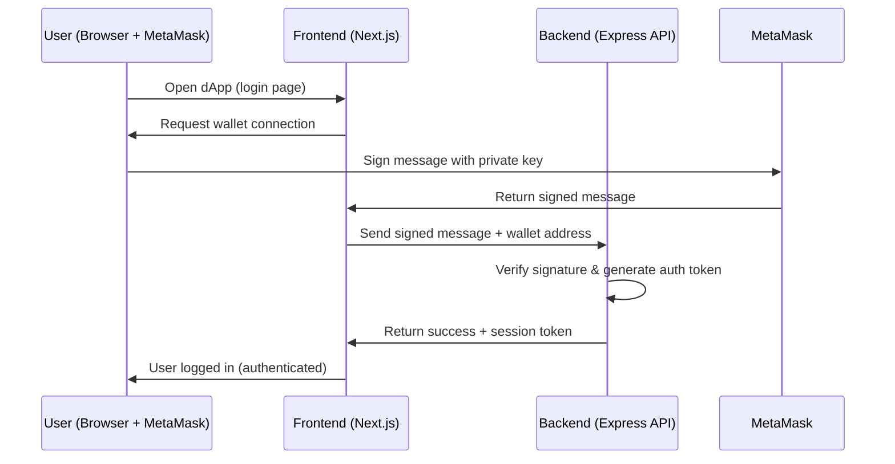

# 🦊 Login with MetaMask

A simple full-stack demo showing how to implement MetaMask authentication in a web application.
This project demonstrates how to connect a dApp to the Ethereum blockchain, verify wallet ownership, and log users in securely without traditional credentials.



## 📂 Project Structure

The repository has two main parts:

- [backend](https://github.com/anton-karlovskiy/login-with-metamask-prototype/blob/main/backend) → REST API built with Express.js

- [frontend](https://github.com/anton-karlovskiy/login-with-metamask-prototype/blob/main/frontend) → Web client built with Next.js

## 🚀 Getting Started

### 1. Install Dependencies

From the root of the repo:

```bash
yarn install                 # Install root dependencies
cd backend && yarn install   # Install backend dependencies
cd ../frontend && yarn install  # Install frontend dependencies
cd ..                        # Return to root
```

### 2. Start the Project

Run both frontend and backend together:

```bash
yarn start
```

- Backend → runs at http://localhost:8000

- Frontend → runs at http://localhost:3000

### 3. Run Services Separately (Optional)

You can also start each service individually:

```bash
# Start backend
cd backend
yarn start

# Start frontend
cd frontend
yarn start
```

## 🔑 Features

- 🔒 Secure wallet-based authentication using MetaMask

- 🌐 Full-stack setup with Next.js and Express.js

- 🛠️ Easy to run locally with yarn start

## 🔄 Usage Flow



## 📌 Notes

- Ensure you have MetaMask installed in your browser before testing.

- This project is intended as a learning/demo app and can be extended into production-ready Web3 applications.